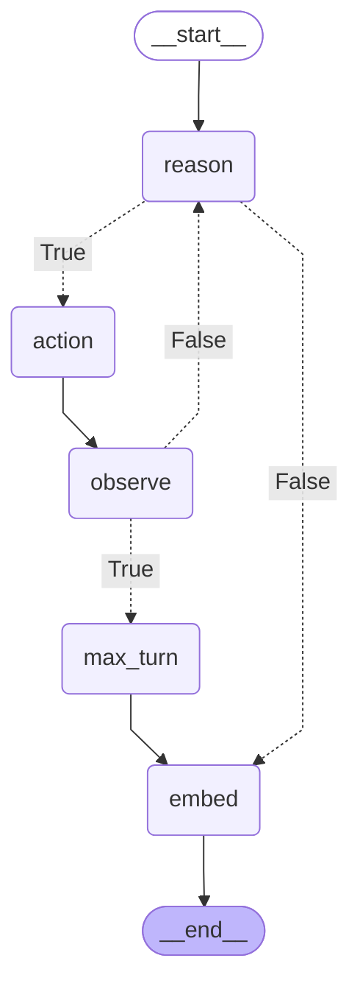

# LangGraph Research Agent

[](https://github.com/FDE-1/langgraph-research-agent/actions/workflows/ci.yml)
[](https://www.python.org/downloads/)
[](LICENSE)
[](https://mypy-lang.org/)
[](https://github.com/astral-sh/ruff)

A **ReAct-style research agent** built on [LangGraph](https://github.com/langchain-ai/langgraph) and the OpenAI Responses API. It reasons in a loop, calls tools when needed (web search, Wikipedia, calculator, file saving, memory search), and persists both conversation state (SQLite checkpoints) and long-term memory (ChromaDB vector store).

---

## Features

- **ReAct loop** — reason → act → observe, repeated until the model answers or the turn budget runs out.
- **Tool calling** — the model decides which tool to invoke via OpenAI function calling (`strict: true` schemas).
- **Turn budget** — the loop is capped at `max_turn` reasoning turns (default `5`); on overrun the agent returns a "make the question shorter" message instead of looping forever.
- **Persistent conversation** — LangGraph `SqliteSaver` checkpoints keyed by `thread_id`, stored in `checkpoint.sqlite`.
- **Long-term memory** — each final answer is embedded (`text-embedding-3-small`) and stored in ChromaDB; retrievable later with the `search_memory` tool.
- **Rate limiting** — `execute` is capped at 10 model calls per 60 seconds. Note this *raises* `RateLimitException` on overrun rather than sleeping.
- **Rich CLI** — interactive terminal chat with panels and spinners.

The model is `gpt-4o` at `temperature=0`.

---

## Architecture

The agent is a compiled LangGraph state machine. `reason` runs the model; if it emits a `function_call`, control routes to `action` → `observe`. `observe` either loops back to `reason` or, once the turn budget is spent, diverts to `max_turn`. When the model answers instead of calling a tool, control routes straight to `embed` (save to memory) → `END`.



### Nodes

| Node | Role |
|------|------|
| `reason` | Calls the model and drains the stream. Emits either `pending_calls` (tool calls) or a final assistant message. |
| `action` | Executes every pending tool call and appends each `function_call_output`. |
| `observe` | Increments the turn counter. |
| `max_turn` | Appends a "turn budget exhausted" assistant message. Reached only when the cap is hit. |
| `embed` | Embeds the final answer into ChromaDB, then terminates. Skips the save when arriving from `max_turn`. |

Two conditional edges drive the loop:

- `is_type_function_call_` — out of `reason`. `True` when `state["pending_calls"]` is non-empty.
- `is_max_turn` — out of `observe`. `True` when `state["turn"] >= max_turn`.

### State

`AgentState` ([utils/state.py](src/langgraph_research_agent/utils/state.py)) is a `TypedDict` with three keys: `messages` (reduced with `operator.add`, so node returns are appended rather than replacing), `turn`, and `pending_calls`.

---

## Tools

| Tool | Description |
|------|-------------|
| `web_search` | General web search via [Tavily](https://tavily.com). |
| `wikipedia` | Fetches a specific Wikipedia page (English). |
| `calculator` | Evaluates math expressions safely via `simpleeval`. |
| `save_file` | Writes content to a file inside the `workspace/` directory (path-traversal guarded). |
| `search_memory` | Semantic search over past answers stored in ChromaDB. |

Every tool raises `ToolException` on failure and is wrapped with `handle_tool_error=True`, so errors come back to the model as text rather than crashing the graph.

`web_search_func` takes its `TavilyClient` as an injected first argument; [main.py](main.py) binds a client and wraps it into a `StructuredTool` before handing it to the agent.

---

## Project structure

```
langgraph-research-agent/
├── main.py                     # Rich CLI entry point
├── Makefile                    # install / fix / lint / typecheck / test / all
├── src/langgraph_research_agent/
│   ├── agent.py                # Agent class + LangGraph graph
│   ├── py.typed                # PEP 561 marker
│   ├── tools/                  # web_search, wikipedia, calculator, save_file, search_memory
│   └── utils/
│       ├── state.py            # AgentState TypedDict
│       ├── setting.py          # env-backed config (paths, keys, collection name)
│       └── logger.py           # loguru logger
├── tests/                      # pytest suite
├── scripts/                    # clean / dist / template scaffolding helpers
├── .github/workflows/ci.yml    # ruff + mypy + pytest on 3.11 and 3.12
└── pyproject.toml
```

`workspace/` (the Chroma store and `save_file` target) and `checkpoint.sqlite` are runtime state and are git-ignored.

---

## Installation

Requires Python ≥ 3.11 and [uv](https://github.com/astral-sh/uv).

```bash
uv sync
```

---

## Configuration

Copy `.env.example` to `.env` and fill in the values:

```dotenv
OPENAI_API_KEY=sk-...        # required — model + embeddings
TAVILY_API_KEY=tvly-...      # required for web_search
collection_name=agent_memory     # optional — ChromaDB collection (default: agent_memory)
client_path=workspace/chroma     # optional — ChromaDB path (default: workspace/chroma)
workspace=workspace              # optional — save_file target dir (default: workspace)
checkpoint_path=checkpoint.sqlite # optional — LangGraph checkpoint DB
debug=false                      # optional — see Debugging below
```

Settings are a `pydantic-settings` `BaseSettings` model in [utils/setting.py](src/langgraph_research_agent/utils/setting.py), reached through the cached `get_settings()`.

> Importing the package has **no side effects**. The Chroma collection, the SQLite checkpointer and the OpenAI client are built in `Agent.__init__`, so no API key is needed to import, and nothing is written to the current working directory. Each resource can also be injected — `Agent(client=..., memory_collection=..., checkpointer=...)` — which is how the test suite runs without a key or a network. [tests/test_import_side_effects.py](tests/test_import_side_effects.py) enforces this.

---

## Usage

```bash
uv run python main.py
```

Then chat in the terminal. Type `quit`, `exit`, or `q` to leave.

Programmatic use:

```python
from langgraph_research_agent.agent import Agent
from langgraph_research_agent.tools.calculator import calculator

agent = Agent(funcs=[calculator])
print(agent.run("What is 12 * (3 + 4)?", thread_id=1))
```

Reusing the same `thread_id` resumes the conversation from its SQLite checkpoint; the system prompt is only sent on the first turn of a thread.

`Agent.draw()` prints the compiled graph as a mermaid diagram.

---

## Debugging

Set `debug=true` in `.env`. The logger switches from the JSON sink at `INFO` to a colourised human-readable sink at `DEBUG`, and every node logs its values — incoming state, tool arguments and return values, turn transitions, and the document written to memory:

```
DEBUG | agent:_action  - [action] invoking calculator with args={'a': '6*7'}
DEBUG | agent:_action  - [action] calculator returned 42
DEBUG | agent:_observe - [observe] turn 0 -> 1 (max_turn=5)
DEBUG | agent:_embed   - [embed] doc_id=a311d599… user_query='what is 6*7?' document='42'
```

---

## Development

```bash
make all        # lint + typecheck + test
make fix        # ruff check --fix + ruff format
make lint       # ruff check + ruff format --check
make typecheck  # mypy --strict
make test       # pytest with coverage
```

Or directly:

```bash
uv run pytest
uv run mypy src/ tests/
uv run ruff check src/ tests/
```

mypy runs in `strict` mode with `disallow_any_explicit` and `warn_unreachable`. Pre-commit hooks (gitleaks, ruff, mypy) mirror CI:

```bash
uv run pre-commit install
uv run pre-commit run --all-files
```

---

## License

MIT.
