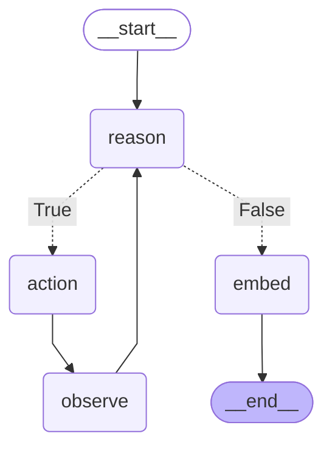

# LangGraph Research Agent

A **ReAct-style research agent** built on [LangGraph](https://github.com/langchain-ai/langgraph) and the OpenAI Responses API. It reasons in a loop, calls tools when needed (web search, Wikipedia, calculator, file saving, memory search), and persists both conversation state (SQLite checkpoints) and long-term memory (ChromaDB vector store).

---

## Features

- **ReAct loop** — reason → act → observe, repeated until the model answers.
- **Tool calling** — the model decides which tool to invoke via OpenAI function calling.
- **Persistent conversation** — LangGraph `SqliteSaver` checkpoints keyed by `thread_id`.
- **Long-term memory** — each final answer is embedded (`text-embedding-3-small`) and stored in ChromaDB; retrievable later with the `search_memory` tool.
- **Streaming** — responses stream from the OpenAI Responses API.
- **Rate limiting** — max 10 model calls per 60 seconds.
- **Rich CLI** — interactive terminal chat with panels and spinners.

---

## Architecture

The agent is a compiled LangGraph state machine. `reason` runs the model; if it emits a `function_call`, control routes to `action` → `observe` → back to `reason`. When the model answers instead of calling a tool, control routes to `embed` (save to memory) → `END`.



### Nodes

| Node | Role |
|------|------|
| `reason` | Calls the model. Returns either a tool call or a final assistant message. |
| `action` | Executes the chosen tool with the model's arguments. |
| `observe` | Increments the turn counter and loops back to `reason`. |
| `embed` | Embeds the final answer and saves it to ChromaDB. Terminal node. |

The conditional edge out of `reason` is decided by `is_type_function_call_` — `True` if the last message is a `function_call`, else `False`.

---

## Tools

| Tool | Description |
|------|-------------|
| `web_search` | General web search via [Tavily](https://tavily.com). |
| `wikipedia` | Fetches a specific Wikipedia page (English). |
| `calculator` | Evaluates math expressions safely via `simpleeval`. |
| `save_file` | Writes content to a file inside the `workspace/` directory (path-traversal guarded). |
| `search_memory` | Semantic search over past answers stored in ChromaDB. |

---

## Project structure

```
langgraph-research-agent/
├── main.py                     # Rich CLI entry point
├── src/langgraph_research_agent/
│   ├── agent.py                # Agent class + LangGraph graph
│   ├── py.typed                # PEP 561 marker
│   ├── tools/                  # web_search, wikipedia, calculator, save_file, search_memory
│   └── utils/
│       ├── state.py            # AgentState TypedDict
│       ├── errors.py           # AgentError
│       ├── logger.py           # loguru logger
│       └── protocol.py         # (legacy)
├── tests/                      # pytest suite
├── workspace/                  # chroma store + save_file target
└── pyproject.toml
```

---

## Installation

Requires Python ≥ 3.11 and [uv](https://github.com/astral-sh/uv).

```bash
uv sync
```

---

## Configuration

Copy `.env.example` to `.env` and fill in the values:

```dotenv
OPENAI_API_KEY=sk-...        # required — model + embeddings
TAVILY_API_KEY=tvly-...      # required for web_search
collection_name=agent_memory # optional — ChromaDB collection (default: agent_memory)
client_path=workspace/chroma # optional — ChromaDB path (default: workspace/chroma)
workspace=workspace          # optional — save_file target dir (default: workspace)
```

> `OPENAI_API_KEY` must be present (non-empty) even for tests, because the ChromaDB embedding function is built at import time.

---

## Usage

```bash
uv run python main.py
```

Then chat in the terminal. Type `quit`, `exit`, or `q` to leave.

Programmatic use:

```python
from langgraph_research_agent.agent import Agent
from langgraph_research_agent.tools.calculator import calculator

agent = Agent(funcs=[calculator])
print(agent.run("What is 12 * (3 + 4)?", thread_id=1))
```

---

## Development

Run tests (with coverage):

```bash
uv run pytest
```

Type check:

```bash
uv run mypy src tests
```
